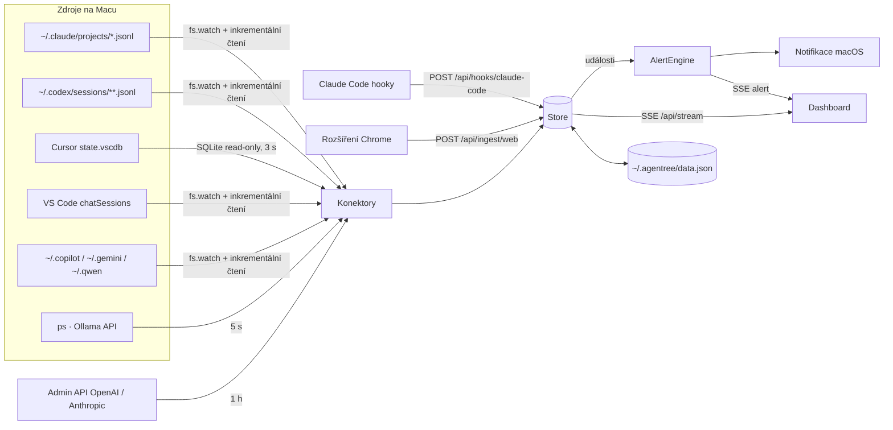

# Architektura

## Přehled toku dat

## Server (`src/`)

| Modul | Zodpovědnost |
|---|---|
| `app.js` | Vytvoří DataStore, Store, AlertEngine a konektory. Řídí start (sken → `ready` → upozornění → časovače) a skládá snapshot `/api/state`. |
| `http.js` | Směrování, validace vstupu, bezpečnost (Host, CSRF, token), SSE vysílání, statické soubory. |
| `model.js` | Jednotný model session a **jediné místo, kde se odvozuje stav** (`deriveStatus`) a souhrn pro klienta (`summarize`). |
| `store.js` | Mapa sessions, souhrny s porovnáním JSON (vysílá jen skutečné změny), limity, kredity, běhová prostředí. |
| `alerts.js` | Přechody stavů → upozornění, deduplikace klíčem, TTL klíčů 60 dní, nativní notifikace. |
| `spend.js` | Čisté funkce: validace, měsíční součty, opakované platby, převody měn, prognóza, prahy rozpočtu. |
| `datastore.js` | Trvalá data s atomickým zápisem (tmp + rename, práva 0600) a debounce 300 ms. |
| `watch.js` | `fs.watch` rekurzivně s automatickou obnovou, fronta souborů (debounce + sériové zpracování). |
| `connectors/*` | Převod formátu konkrétního nástroje do modelu session. |

### Životní cyklus

1. `createApp()` načte `data.json` (vytvoří token pro hooky a rozšíření).
2. `start()` spustí všechny konektory paralelně (`Promise.allSettled` — chyba jednoho neblokuje ostatní).
3. Po úvodním skenu: `store.reevaluate()`, `store.ready = true`, `alerts.start()` si zapamatuje výchozí stavy (staré události tak nevyvolají notifikace), kontrola rozpočtů.
4. Časovače: přehodnocení stavů 5 s, plný průchod souborů 10 s (pojistka proti ztraceným událostem watcheru), seznam konektorů 5 s, rozpočty 1 h.
5. Teprve potom server začne poslouchat. Hooky během startu tiše selžou (curl `-m 2 || true`), Claude Code nezdržují.

### Realtime cesta a latence

- **Soubory:** FSEvents → debounce 40–150 ms → `JsonlTail.read()` čte jen nové bajty od posledního offsetu → `store.commit()` → SSE. Automatický test měří < 2 s, typicky ~100 ms.
- **Hooky:** HTTP požadavek → synchronizace přepisu → úprava stavu → SSE. Jednotky milisekund.
- **Rozšíření:** MutationObserver → throttle 400 ms → background worker → server → SSE. Heartbeat 10 s během generování.
- **Klient:** události se slévají do jednoho `requestAnimationFrame`; obrazovky mění jen oblasti `[data-region]`, jejichž HTML se změnilo (`fill()`), takže formuláře a fokus zůstávají.

## Stavový model session

Konektor nastavuje fakta, `deriveStatus()` z nich určí stav v tomto pořadí:

| Priorita | Stav | Podmínka |
|---|---|---|
| 1 | `limited` | `limit.reached` a (čas obnovy v budoucnu, nebo bez času obnovy a < 5 h) |
| 2 | `needs_input` | `pending` (povolení, otázka, plán) mladší než 12 h |
| 3 | `working` | `running` a poslední známka běhu mladší než `staleMs` |
| 4 | `idle`/`archived` | `ended` (SessionEnd) |
| 5 | `waiting` | poslední aktivita < 3 h |
| 6 | `idle` | < 24 h |
| 7 | `archived` | starší |

`staleMs` podle zdroje: Claude Code 30 min (konec tahu je v přepisu explicitní — `end_turn`, přerušení, chyba API, hook `Stop`; model může několik minut generovat bez zápisu), Codex 15 min, Cursor 10 min, CLI chaty 2–3 min, web 45 s (heartbeat).

Když `running` vyprší bez explicitního konce, stav je `waiting`/`idle` s příznakem `stale: true` a důvodem „Delší dobu bez aktivity“. **Takový přechod nikdy nevyvolá upozornění „dokončil úlohu“.**

Nástroj Claude Code čekající bez hooků déle než 90 s dostane důvod „… · možná čeká na tvé povolení“ (heuristika, bez upozornění). S hooky se žádost o povolení hlásí přesně a okamžitě.

## Klient (`public/js/`)

- `app.js` — hash router (`#/prehled`, `#/agenti`, `#/agent/<id>`, `#/statistiky`, `#/utrata`, `#/upozorneni`, `#/nastaveni`), SSE s frontou událostí během načítání snapshotu, horní lišta, scéna s body aktivních agentů, paleta ⌘K, notifikace.
- `state.js` — jediný zdroj pravdy v prohlížeči; `emit()` slévá témata změn.
- `views/*.js` — každá obrazovka má `mount(el, params, query)`, `update(topics)`, `unmount()` a volitelně `query()`.
- `charts.js` — plošný graf s crosshairem a ovládáním šipkami, donut, gauge, heatmapa, sloupcový graf, časová osa. Vše SVG/HTML bez knihoven.

## Výkon (naměřeno na vývojovém Macu, v0.2.0)

- Úvodní načtení 82 sessions (≈106 MB přepisů Claude + 206 souborů Codexu, okno 30 dní): **1,3 s**.
- Další aktualizace čtou jen přírůstky souborů.
- Paměť: přepis držen max. 400 posledních položek na session, texty zkrácené na 4 000 znaků.

## Odolnost

- Watcher spadne nebo složka neexistuje → nový pokus každých 5 s; plný průchod každých 10 s.
- Poškozený nebo rozepsaný řádek JSONL se přeskočí; offset se posune jen za kompletní řádky.
- Zkrácený soubor (přepsaný) → session se znovu načte od začátku.
- SSE výpadek → EventSource se připojí sám, klient znovu stáhne snapshot.
- Zápis `data.json` je atomický; poškozený soubor se nahradí výchozími hodnotami (bez pádu).

## Rozhodnutí

| Rozhodnutí | Důvod | Kdy přehodnotit |
|---|---|---|
| Bez závislostí, bez buildu | Instalace jedním příkazem, žádný supply-chain risk u nástroje s přístupem k přepisům | Při přechodu na nativní aplikaci nebo týmovou synchronizaci |
| SSE místo WebSocketu | Jednosměrný tok, automatická obnova, jednodušší server | Pokud UI bude posílat realtime příkazy |
| Stav v paměti + JSON soubor | Zdroje jsou pravda; Agentree je jen pohled | Historie > 30 dní nebo více zařízení → SQLite |
| Heuristiky stavu v jednom místě | Konzistence mezi zdroji, testovatelnost | — |
