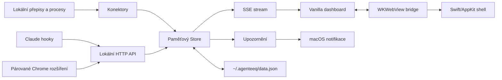

# Agenteeq — produktový a architektonický kompas

Tento dokument je společný zdroj pravdy pro produktové rozhodování, návrh rozhraní a další agentický vývoj. Nenahrazuje detailní kontrakty v `docs/DATA-CONTRACT.md`, bezpečnostní hranice v `docs/SECURITY.md` ani seznam konektorů v `docs/CONNECTORS.md`; určuje, jak tyto části držet v jednom soudržném produktu.

## 1. Co Agenteeq je

Agenteeq je lokální macOS pracovní velín pro člověka, který souběžně používá více AI agentů. Zkracuje tři nejdražší mezery v práci:

1. **Pozornost:** ukáže, že agent čeká na člověka, dřív než se práce zbytečně zastaví.
2. **Kontext:** spojí vlákna, složky a projekty napříč nástroji, bez ručního hledání v chatových aplikacích.
3. **Kontrola:** oddělí měřené tokeny, limity, ruční výdaje a ověřené API náklady; nic z toho nevydává za jinou metriku.

Primární uživatel je jednotlivec nebo malé studio na macOS. Produkt je local-first: bez účtu a bez cloudového přenosu přepisů funguje základní pracovní přehled. Týmová synchronizace, mobilní notifikace a SSO jsou budoucí samostatné produkty, ne skrytý předpoklad současné verze.

## 2. Produktová pravda a uživatelské sliby

| Oblast | Co Agenteeq smí slíbit | Co nesmí tvrdit bez živého ověření |
|---|---|---|
| Aktivita agentů | Stav odvozený z lokálního přepisu, procesu, hooku nebo párovaného rozšíření | Že agent skutečně pracuje, pokud je k dispozici jen staré datum souboru |
| Tokeny | Lokálně zpracované tokeny z podporovaných přepisů | Cena, vyčerpaný kredit nebo limit předplatného, pokud zdroj neposkytl přesnou hodnotu |
| Výdaje | Ručně vložené položky a hodnoty z úspěšného Admin API | Útrata ChatGPT, Claude, Gemini, Perplexity či Groku v předplatném bez jejich oficiálního zdroje |
| Webové aplikace | Podpora párování Chrome rozšíření a stav „neověřeno / data nepřichází“ | Připojení, autorizaci nebo čtení chatu před skutečným párováním a otevřením služby |
| Bezpečnost | Lokální bind, CSRF/origin ochrana, tokenové párování a Klíčenka v desktopu | Absolutní ochrana proti malwaru nebo jinému programu pod stejným macOS účtem |

Tato tabulka je produktový guardrail. Každá nová karta, badge, graf nebo prodejní text musí zachovat rozdíl mezi **ověřeným zdrojem**, **beta konektorem**, **heuristikou** a **neznámým stavem**.

## 3. Cílové pracovní toky

### Ranní orientace

Uživatel otevře Přehled a během několika sekund ví: co běží, co potřebuje rozhodnutí, zda se blíží limit a které projekty mají aktivitu. Přehled není reportovací plocha; nejdůležitější akce má být zřejmá bez čtení celé obrazovky.

### Reakce na zaseknutého agenta

Upozornění vede na konkrétní session a následně do původní aplikace či terminálu. Agenteeq nemá předstírat vzdálené schvalování, pokud nástroj takové bezpečné API nenabízí.

### Spuštění práce z projektu

Uživatel zvolí projekt, pracovní složku a agenta. Server sestaví bezpečný plán spuštění; zadání není součást shellového příkazu. Výsledek běhu se vrací do přehledu jako běžná session.

### Připojení další služby

Nastavení nejprve řekne, zda je zdroj lokálně nalezený, v betě nebo skutečně přijímá data. Pro webové služby vede krátký pairing flow rozšíření Chrome. Přihlašování do cizích služeb nedělá Agenteeq za uživatele a nikdy nesbírá jeho heslo; používá existující přihlášení v prohlížeči nebo oficiální API klíč uložený v Klíčence.

## 4. Designový systém a vzhled

Identita je „koncertní sál“: temná scéna v horní vrstvě, mlžná pracovní plocha, samet pro rozhodnutí, smaragd pro aktivní práci a mosaz pro orientační akcent. Všechny hodnoty leží v tokenech `public/styles.css`; komponenta nesmí zavádět vlastní odstín, radius, stín nebo easing bez aktualizace tokenového systému.

### Vzhledové režimy

- `light` je výchozí a zůstává výchozí při první instalaci.
- `dark` je samostatný večerní režim, ne pouhá inverze barev.
- `system` sleduje `prefers-color-scheme` a změnu zachytí bez restartu aplikace.
- Preference se ukládá do lokálního DataStore a do `localStorage` pouze jako prevence záblesku nesprávné barvy před načtením dashboardu.
- Desktop bridge nastavuje stejné `NSAppearance` i pro nativní chrome macOS.

Kontrast textu a důležitých stavů musí být minimálně WCAG 2.2 AA (4.5:1 pro běžný text, 3:1 pro velký text a necitlivé ovládací obrysy). Dark mode používá světlý text na tmavých vrstvách; nelze ho hodnotit jen screenshotem v jednom prohlížeči. Nový design musí projít automatizovanou kontrolou tokenových kontrastů a vizuálním QA v Chromiu i WebKitu.

### Interakční standard

Každé klikatelné místo má jasný hover, `:focus-visible`, aktivní stav a chybný/disabled stav. Vlastní nabídky jsou součástí designu: nepoužívat nekontrolovaný systémový dropdown tam, kde je potřeba kontext, projekty nebo navigace. Pohyb je funkční, krátký a respektuje `prefers-reduced-motion`; žádné živé aktualizace nesmí zavřít otevřený formulář, menu nebo sebrat fokus.

### Profilové obrázky

Profilové obrázky jsou lokální inline SVG, ne vzdálené assety. Výhodou je ostrý Retina výstup, okamžité vykreslení, nulová síťová stopa a jednotná abstraktní řeč. Rozšiřování kolekce znamená přidat celou sadu konzistentních variant v `public/js/avatars.js`, zachovat stabilní indexy existujících voleb a ověřit grid na desktopu i mobilu.

## 5. Systémová architektura

### Hranice odpovědností

| Vrstva | Vlastník | Pravidlo změny |
|---|---|---|
| `src/connectors/` | Převod konkrétního zdroje na fakta o session | Parser musí být čistě testovatelný; konektor nikdy neurčuje konečný `status` |
| `src/model.js` | Odvození stavu a jednotný model | Jediné místo pro změnu pravidel `working`, `needs_input`, limitů a stale chování |
| `src/store.js` | Realtime stav, diffs, SSE události | Nevysílat změnu, která se fakticky nestala |
| `src/http.js` | Lokální API, CSP, validace, CSRF/origin | Každá nová mutace má schema, bezpečnostní kontrolu, data contract a test |
| `src/datastore.js` | Trvalé uživatelské preference | Atomický zápis a bezpečná normalizace starých/poškozených hodnot |
| `public/js/state.js` | Jeden zdroj pravdy v klientu | Témata změn musí být co nejužší, aby se neobnovovaly celé obrazovky |
| `public/js/views/` | Vykreslení konkrétní obrazovky | `mount/update/unmount`; formuláře, otevřená menu a fokus přežijí živou událost |
| `desktop/` | Vlastnictví procesu, lifecycle, macOS chrome | Jedna instance, vlastněný server, nulové plošné zabíjení cizích procesů |

## 6. Rozhodovací strom pro nový konektor

1. Existuje oficiální lokální datový formát nebo podporované API? Pokud ne, neoznačovat službu jako „připojeno“.
2. Je přípustné zpracovat data lokálně a odpovídá to podmínkám dané služby? Pokud není jistota, produktový stav je beta a je potřeba právní/produktové posouzení.
3. Lze bezpečně určit fakta o session a mapovat je do společného modelu? Pokud ne, ukazovat pouze explicitně omezenou kartu zdroje.
4. Jsou přidány parser fixtures, stavové testy, bezpečnostní test vstupu a živé QA s reálnou přihlášenou službou? Teprve pak lze změnit `verified`.
5. Je uživatelova akce zřejmá a reverzibilní? Přihlášení se vždy děje na doméně dodavatele; API klíč jde do Klíčenky, ne do frontendového JavaScriptu.

## 7. Vývojový protokol pro další agenty

Před změnou:

1. Přečti `AGENTS.md`, tento dokument a dotčený kontrakt/implementaci.
2. Zjisti aktuální větev, diff a zdroj dat. Starší summary není důkaz.
3. Napiš si regresní povrch: data, bezpečnost, performance, klávesnice, desktop a mobile.

Během změny:

1. Používej existující tokeny, `esc()` a designové komponenty.
2. U realtime UI preferuj selektivní `fill()` před přepisem rodičovského stromu.
3. Nepřidávej runtime závislost, telemetrii, síťový endpoint ani cloudovou databázi bez explicitního produktového rozhodnutí.
4. Nezapisuj ani neloguj přepisy, API klíče, pairing tokeny nebo osobní cesty.
5. Při změně dat aktualizuj server, klientský stav, data contract a test ve stejném commitu.

Před předáním:

1. `npm run check`, `npm test`, relevantní browser QA a pro distribuční změnu `npm run smoke`.
2. Při vizuální změně screenshot desktopu i mobilu a ověřit světlý/tmavý režim.
3. Ověřit nulové chyby konzole, ovládání klávesnicí, fokus a případně AA kontrast.
4. Projít diff na tajemství a nechtěné změny.
5. Aktualizovat `CHANGELOG.md` a relevantní dokumentaci. Vše posílat přes feature branch a PR; `main` se mění až po green kontrole.

## 8. Releasová brána

| Brána | Důkaz |
|---|---|
| Funkčnost | Testy pokrývají novou datovou/uživatelskou větev včetně chyby nebo návratu |
| Realtime | Otevřené UI neztrácí stav při živé aktualizaci |
| Vzhled | Chromium + WebKit screenshoty; 375/900/1440 px; light/dark/system, kde se změna dotýká vzhledu |
| Přístupnost | Klávesnice, viditelný fokus, reduced motion, textový kontrast AA |
| Bezpečnost | Žádná tajemství v diffu; server stále lokální; vstupy validované; nové URL/otevírání explicitně allowlistované |
| Distribuce | Balíček smoke test, podpis ověřený; pro veřejný macOS release Developer ID + notarizace |
| GitHub | Čistý commit, branch push, PR s výsledky QA, ověřená integrace do `main` |

## 9. Co zatím nepatří do slibu produkční verze

- Neexistuje univerzální SSO, které by bezpečně přihlásilo uživatele do ChatGPT, Claude, Perplexity, Groku a dalších nezávislých dodavatelů. Agenteeq může usnadnit autorizaci přes jejich vlastní login nebo oficiální API klíče, nesmí fungovat jako sběrač hesel.
- Přesná cena a předplatné napříč dodavateli nejsou odvoditelné z tokenů. Kde není důvěryhodné API, musí zůstat ruční položka nebo jasně popsaná absence dat.
- Ad-hoc podepsaný lokální build není veřejně distribuovatelný release. Před konferencí, klientskou distribucí nebo Mac App Store je nutný samostatný release proces z `docs/SECURITY.md`.
